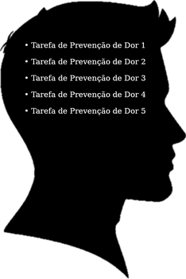
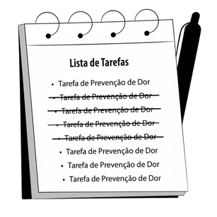
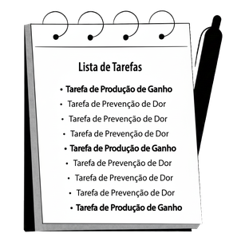

# CAPÍTULO 3 - EQUILIBRAR 

EQUILIBRAR AS TAREFAS DE PREVENÇÃO DE DOR E DE PRODUÇÃO DE GANHO

## Prevenir problemas ou buscar o ganho?

Ler um livro ou assistir a uma série no Netflix? Dormir mais cedo ou curtir o Instagram deitado? Fazer exercícios ou relaxar no sofá? Arroz branco ou integral? Chocolate de sobremesa ou uma fruta? Abastecer o carro ou ir direto para casa descansar? Comprar um notebook ou juntar dinheiro? Pular da cama quando o despertador toca ou acionar a função soneca?

Você pode não saber, mas há duas forças opostas por trás de todas as nossas escolhas: dor e ganho. Sempre que nos sentimos impelidos a executar uma tarefa é para prevenir a dor ou para buscar o ganho. Em cada atitude de todos os seres humanos da terra, existe a atuação de uma dessas forças opostas, direcionando as nossas decisões sobre todos os aspectos da vida.

Vamos analisar algumas situações.

Imagine o aspecto saúde! Você deve conhecer alguém que, apesar de seus constantes apelos, passou décadas com sobrepeso, sedentário, ingerindo alimentos pobres em nutrientes e que só mudou seu estilo de vida após uma severa advertência médica sobre o aparecimento de possíveis doenças no futuro. Qual foi o fator que desencadeou sua mudança de comportamento? O medo de perder a saúde.

Agora imagine uma outra pessoa com bons hábitos de vida. Suas taxas estão ótimas; ela dorme e se alimenta bem; pratica exercícios físicos regularmente; seu peso está dentro do ideal; mas decide melhorar ainda mais seu condicionamento físico e sua alimentação no intuito de correr uma maratona daqui a seis meses. O que a motivou a buscar esse resultado? O desejo de avançar em direção a algo que ela quer.

Observe: são dois lados diferentes de uma mesma moeda. Temos aqui duas pessoas que tomaram a mesma decisão de se exercitarem intensamente, contrastadas por motivações muito diferentes. A primeira está com medo das consequências do sedentarismo e a segunda sonha com os frutos de uma idealizada maratona.

Vamos para um outro exemplo.

Pense, agora, na liderança de uma empresa ou de uma instituição. É só passar um dia observando os chefes de equipes e poderá testemunhar que muitos gastam a maior parte do dia em atividades que criam pouco ou nenhum valor para a empresa:

* vigilância dos horários de entrada e saída;
* patrulhamento de tempo na copa;
* fiscalização de faltas ao trabalho;
* policiamento de conversas no corredor;
* campanhas informativas para manter a limpeza dos banheiros.

Perceba que é uma chefia totalmente voltada a prevenir problemas. Uma quantidade enorme de energia está sendo desperdiçada apenas para impedir que as coisas piorem. E qual o problema disso? O foco não está voltado para o crescimento da organização, mas apenas para a manutenção das coisas do jeito que já estão.

Em contraponto, um líder que concentra sua atenção em buscar o ganho, investirá boa parte de seu tempo priorizando atividades mais eficientes como:

* treinar e orientar constantemente sua equipe;
* criar planos de desenvolvimento individual;
* marcar reuniões de alinhamento estratégico;
* aperfeiçoar processos;
* encantar e fidelizar clientes;
* pensar em novas estratégias.

Qual dessas duas empresas tem mais chances de prosperar? Já sabemos a resposta.

Portanto, essas duas forças gêmeas — o medo de perder e o desejo de ganhar — embasam todas as nossas decisões. Por mais que ambas façam parte de nossa rotina diária, a diferença de impacto entre elas é gigantesca em termos de resultados.

## Tarefas de Prevenção de Dor X Tarefas de Produção de Ganhos

Uma das estratégias mais importantes que adotei na minha rotina foi dividir todas as minhas tarefas diárias em dois grupos: as que evitam problemas e as que produzem ganhos. Sobre as tarefas do primeiro grupo, chamaremos de Tarefas de Prevenção de Dor (ou Tarefas de Dor), pois elas evitam o aparecimento de problemas decorrentes da perda de algo que você possui. As tarefas do segundo grupo batizaremos de Tarefas de Produção de Ganho (ou Tarefas de Ganho), visto que elas lhe direcionam a buscar algo que você gostaria de ter.

No livro "O Poder da Decisão", o autor, Steve McClatchy, diz que sempre que escolhemos realizar qualquer coisa, desde atividades mais simples, como trocar uma lâmpada queimada, até as mais complexas, começar a empreender, por exemplo, estamos optando pelo desejo de ganhar ou pelo medo de perder.

Os homens mais prósperos que conheci são aqueles que aprenderam a investir uma grande parcela do seu dia para as Tarefas de Produção de Ganho. Em contrapartida, os que se sentem menos satisfeitos são aqueles que organizam a maior parte da sua rotina em torno das Tarefas que Previnem a Dor.

### Tarefas de Prevenção de Dor

As Tarefas de Prevenção de Dor são aquelas atividades que, após serem realizadas, não produzem nenhuma melhoria na nossa vida. No máximo, evitam que as coisas piorem. Quando, por exemplo, a luz de combustível do painel do carro se acende, sabemos que o tanque entrou na reserva. Qual é o nosso comportamento padrão quando isso acontece? Ir o mais rápido possível até o posto mais próximo e abastecer. Essa ação não acarreta melhoras em nossas condições atuais. As circunstâncias continuam iguais às de antes. É vida que segue!

Agora, vamos supor que uma pessoa resolve ignorar esse tipo de alerta do painel. Se continuar dirigindo por aí, porque julga ter coisas mais importantes para fazer, ela correrá um risco enorme de ficar com o carro parado sem combustível no meio de uma avenida movimentada, em horário de rush, colhendo as consequências desse previsível transtorno. Para evitar possíveis problemas, abastecemos o veículo e prosseguimos com os afazeres do dia.

Fica evidente que a vida não recebe um upgrade porque paramos no posto de combustível, mas ela pode piorar bastante se negligenciarmos essa obrigação. Essa é a prova que "abastecer o carro" é uma Tarefa de Prevenção de Dor.

<table>
  <tr>
   <td>Ação
   </td>
   <td>Consequência
   </td>
  </tr>
  <tr>
   <td><strong>Abastecer o carro</strong>
   </td>
   <td>Manter a vida do mesmo jeito que antes.
   </td>
  </tr>
  <tr>
   <td><strong>Não abastecer o carro</strong>
   </td>
   <td>Piorar a sua vida: carro parado no meio da rua.
   </td>
  </tr>
</table>

Vejamos um outro exemplo. Por acaso algum homem vai ao proctologista porque gosta? Em geral, vamos a esse especialista para evitar futuros aborrecimentos. Ignore essa responsabilidade e quais serão as consequências? A possibilidade de doenças graves. Como não queremos passar por enfermidades, pagamos o preço de realizar essa ação mesmo contra as nossas vontades imediatas. Ninguém dá um passo adiante, rumo aos seus objetivos, por fazer os exames necessários, mas, pelo menos, nos prevenimos de problemas futuros.

<table>
  <tr>
   <td>Ação
   </td>
   <td>Consequência
   </td>
  </tr>
  <tr>
   <td><strong>Ir ao proctologista</strong>
   </td>
   <td>Prevenir-se para manter a vida do mesmo jeito que antes.
   </td>
  </tr>
  <tr>
   <td><strong>Não ir ao proctologista</strong>
   </td>
   <td>Desenvolvimento de possíveis doenças graves.
   </td>
  </tr>
</table>

Entenda que não estou dizendo que as atividades voltadas a evitar as crises não sejam importantes. Sem sombra de dúvidas, elas devem ocupar uma parte do seu tempo diário, mas não todo o tempo.

Ao ser diligente em executar suas Tarefas de Prevenção de Dor, você estará cumprindo com suas obrigações e responsabilidades, o que não é um mau caminho. Apenas tenha a expectativa correta em relação a elas. Não espere que sua vida dê um salto qualitativo enquanto ocupa várias horas do seu dia reagindo a tudo aquilo que, de alguma forma, ameaça piorar o seu ambiente.

### As Tarefas de Prevenção de Dor não produzem melhorias

Já faz sete anos que moro no mesmo apartamento. Assim que eu e a Carol nos mudamos, Luiza, nossa filha mais nova, ainda não tinha nascido. A mais velha, Mariana, acabara de completar seis meses de idade. De cara, contratei uma empresa para colocar redes de proteção em todas as janelas e na varanda. Assim que terminou a instalação, o responsável recomendou que eu as trocasse dentro de, no máximo, cinco anos.

Decorrido esse prazo, julguei que as redes ainda estavam em boas condições de uso e decidi permanecer com elas por mais algum tempo. Depois de mais dois anos, fiz um novo check-up no material e percebi que os fios da rede estavam secos, quebradiços e haviam perdido sua elasticidade. Empregando um pouco de força, era possível até rasgá-los.

Zelando pelas minhas duas pequenas, imediatamente, agendei a troca do material para o outro dia. Agora que estamos com redes novas de proteção, sabe o que mudou em minha vida? Literalmente nada! O conforto, o cheiro e a aparência da casa continuam iguais. Apesar do investimento, ninguém que me visitou disse: "Essas telas fizeram toda a diferença no layout da sua casa". Sabe por que ninguém nota essas coisas? Porque essa é uma atividade voltada a evitar problemas e não produzir melhorias.

<table>
  <tr>
   <td>Ação
   </td>
   <td>Consequência
   </td>
  </tr>
  <tr>
   <td><strong>Trocar a rede de proteção</strong>
   </td>
   <td>Manter a vida do mesmo jeito que antes.
   </td>
  </tr>
  <tr>
   <td><strong>Não trocar a rede de proteção</strong>
   </td>
   <td>Piorar a vida: insegurança e exposição a acidentes.
   </td>
  </tr>
</table>

Homens dos quatro cantos do planeta estão todo tempo correndo de lá para cá, resolvendo tarefas que evitam a dor e, mesmo assim, ficam frustrados por se sentirem estagnados, apesar de se esforçarem tanto. Eles não entenderam que, para avançar em suas condições atuais, as atividades certas são as Tarefas de Produção de Ganho.

### Tarefas de Produção de Ganho

Eis aqui um dos maiores segredos dos homens de sucesso: aprender a extrair satisfação da priorização das Tarefas de Produção de Ganho. Mas o que são essas tarefas?

Ao contrário das Tarefas de Prevenção de Dor, fundamentadas em livrar você de um possível problema, as Tarefas de Produção de Ganho vão lhe conduzir em direção ao progresso. Tomando um alpinista como parâmetro, toda ação relacionada a evitar que ele caia de uma montanha significa uma Tarefa de Prevenção de Dor. Lógico que permanecer no mesmo lugar é melhor do que cair, mas para continuar subindo em direção ao cume, o montanhista terá que realizar Tarefas de Produção de Ganho.

Definitivamente, as tarefas que nos direcionam para o ganho produzem resultados muito mais significativos em nossa vida pessoal e profissional do que aquelas que estão limitadas a nos livrar das crises. É por isso que os homens produtivos preenchem uma parte importante do seu tempo trabalhando em cima delas.

Eu imagino que ler esse livro seja uma Tarefa de Ganho para você e escrevê-lo foi uma Tarefa de Ganho para mim também. No meu caso, valorizou ainda mais o meu currículo, gerou novas receitas e me trouxe realização pessoal. Aperfeiçoei meu mundo ao concluir essa atividade. E para você também é um ganho, pois está ampliando o seu conhecimento, te ajudando a se organizar melhor, suscitando novas ideias, e desenvolvendo suas competências.

Se o tempo está passando e você se sente estagnado em alguma área da vida, a sua carreira, finanças, saúde ou relacionamentos, por exemplo, é provável que você esteja investindo muito mais tempo nas Tarefas de Prevenção de Dor do que nas Tarefas de Produção de Ganho. Apenas as Tarefas de Ganho são capazes de aperfeiçoar a sua vida e desenvolver o potencial latente que há em cada um de nós.

## Querer Fazer x Ter que Fazer

As Tarefas de Prevenção de Dor são também atividades caracterizadas pela obrigatoriedade. Não é uma questão de "querer fazer", mas de "ter que fazer”. Não há a opção de desconsiderá-las só porque não estamos com vontade de lidar com elas. Mas, você pode me questionar: "Rafael, vivo em um país livre. Ninguém pode me obrigar a fazer o que eu não quero. Eu faço o que eu quiser". As coisas não são tão simples assim. Você e eu podemos até decidir o que queremos, mas não podemos escolher as consequências das nossas escolhas. Ao ignorar uma tarefa de prevenção, vai aparecer a dor que você deveria ter evitado.

Experimente, por exemplo, não pagar a conta de energia. Não sei se já passou pelo constrangimento de cortarem a luz de sua casa por você ter se esquecido de quitar um boleto. A situação é tão embaraçosa que tenho certeza que você fará de tudo para que isso não se repita. Do nada, um funcionário da empresa de energia aparece na sua residência já decidido a realizar o bloqueio, ignorando os seus apelos por piedade e misericórdia.

Dentre os diversos transtornos: você permanecerá no escuro e sem energia elétrica pelo período de até 48 horas; correrá o risco de estragar os alimentos congelados; tomará banhos frios (e justamente quando a temperatura está mais baixa); passará horas em ligações para a distribuidora de energia; pagará multas e taxas; e, principalmente, sua esposa fritará você com os olhos por expor a família a essa situação.

As dores que você evitou durante todos esses anos em que permaneceu pagando a conta em dia, agora foram visitá-la devido a uma única falha! Bastou apenas um deslize. Sendo assim, alguém pode até escolher não quitar o boleto de energia, mas ignorar uma Tarefa de Prevenção de Dor é sinônimo de a crise bater à sua porta.

Hoje de manhã, um pouco antes de começar a escrever esse capítulo, enviei a minha esposa um e-mail solicitando um arquivo do Imposto de Renda do ano passado. Temos apenas 20 dias para entregar toda a documentação. Não posso, simplesmente, ignorar essa responsabilidade porque há outras coisas para fazer ou porque não quero fazer. Eu preciso fazer e ponto final! Não tenho escolha! Visando evitar o aparecimento de problemas, busco realizar essa ação dentro das condições estabelecidas.

Enquanto temos essas atividades caracterizadas por um *ter que fazer*, as Tarefas de Produção de Ganho possuem um *querer fazer*. Normalmente, ninguém vai lhe pressionar a realizar uma atividade de ganho. Elas só farão parte da sua rotina se você realmente quiser executá-las.

Este é o meu sétimo livro publicado. Até hoje fico perplexo quando penso que ninguém, em nenhum momento, pegou no meu pé para que eu os escrevesse. Porém, já estive sobre pressão com questões muito mais triviais como, por exemplo, mandar arrumar um pequeno barulho no carro da Carol ou sair de casa a noite para comprar um sabão em pó que ela me solicitou de urgência. Agora eu pergunto: qual dessas categorias de tarefas têm o potencial de melhorar a minha vida? Escrever o livro, é claro!

Conforme diz o autor Robert J. McKain: "A razão pela qual muitas metas não são atingidas é que gastamos nosso tempo fazendo primeiramente as coisas secundárias". Chega a soar engraçado que ninguém dê importância ao fato de estarmos ou não dando tempo suficiente para as Tarefas de Produção de Ganho. Frise-se, essas são as únicas tarefas que podem, definitivamente, virar uma chave nas nossas vidas. Em compensação, se não priorizamos as Tarefas de Prevenção de Dor, sofremos com uma pressão implacável. Seguem outros exemplos:

* Não temos cobrança para participarmos de um curso de casais (Tarefa de Produção de Ganho), mas somos pressionados a renovar o seguro do carro (Tarefa de Prevenção de Dor);
* Ninguém fala nada se não fizermos uma aposentadoria privada (Tarefa de Produção de Ganho), mas experimente não pagar o boleto da mensalidade do Netflix (Tarefa de Prevenção de Dor);
* Não recebemos cobrança para ler um livro a cada quinze dias (Tarefa de Produção de Ganho), mas recebemos uma pressão medonha para mandar arrumar a goteira de uma pia (Tarefa de Prevenção de Dor);
* Ninguém fica no nosso pé para inserirmos mais saladas e frutas às refeições (Tarefa de Produção de Ganho), mas se ficarmos sem tomar um remédio para pressão alta, todos ficarão preocupados (Tarefa de Prevenção de Dor);
* Ninguém vai falar nada se não participarmos de cursos de atualização profissional uma vez por semestre (Tarefas de Produção de Ganho), mas irão nos punir se chegarmos dez minutos atrasados ao trabalho (Tarefa de Prevenção de Dor);
* Ninguém vai puxar nossa orelha por não estarmos nos exercitando (Tarefa de Produção de Ganho), mas nos criticam se a nossa camisa estiver amarrotada (Tarefa de Prevenção de Dor).

Poderíamos fazer uma lista com dezenas de outros exemplos.

Perceba: Tarefas de Prevenção de Dor são mais invasivas do que Tarefas de Ganho. Apesar de barulhentas, seus resultados são tímidos. Já as Tarefas de Produção de Ganho, apesar de mais silenciosas, produzem resultados extravagantes.

Analisando o tempo, as Tarefas de Ganho sempre podem esperar, não há prazos finais! Em contrapartida, as Tarefas de Dor quase sempre são urgentes. Assim, todo homem precisa ter em mente que as tarefas que nos fazem prosperar financeira, emocional, fisicamente, só irão se sobrepor a questões mais básicas da vida se, intencionalmente, decidirmos priorizá-las.

## Tarefas de Ganho exigem mais esforço

Não há dúvida que Tarefas de Ganho demandam mais esforço. Em geral, qualquer homem consegue calibrar um pneu, trocar uma lâmpada, pagar uma conta pelo celular, comprar passagens, reservar um hotel ou marcar uma consulta. Em contrapartida, atividades como abrir um novo negócio, melhorar seu portfólio de produtos, pensar em estratégias para multiplicar suas receitas, escrever um livro, gerenciar melhor suas finanças, alcançar a maestria em uma área específica, melhorar seu casamento, requerem muito mais desafios. Se não reservamos, propositadamente, partes de nosso dia para as Tarefas de Ganho, a natureza humana sempre nos levará para o caminho mais fácil, em geral, o menos importante.

Há uma lei incontestável na natureza: cada semente gera conforme a sua espécie. Não posso plantar limão e esperar colher uma maravilhosa pitaya. Escolher o mais fácil agora produzirá frutos inexpressíveis. Ao passo que, priorizar o que é mais difícil trará os resultados que você tanto almeja.

As Tarefas de Prevenção de Dor, normalmente, estão relacionadas a verbos como consertar, arrumar, reformar, reparar, limpar, lavar, levar, trocar e devolver. Já as tarefas de Produção de Ganho estão associadas a verbos mais sofisticados como: criar, pensar, planejar, pesquisar, analisar, desenvolver, refletir, engajar e criar.

## Tarefas de Prevenção de Dor são cíclicas

Você pode até tentar zerá-las, mas será um esforço em vão. As Tarefas de Prevenção de Dor nunca acabam. Elas sempre estarão fazendo parte da sua rotina em abundância! Experimente pelo menos uma vez passar vários dias tentando concluir todas elas e logo perceberá que se trata de uma batalha perdida. Elas se multiplicam muito mais rápido do que sua capacidade e sua velocidade de executá-las.

Houve um momento em que suspeitei que o meu carro tinha uma espécie de dom... o dom consumir rapidamente o combustível. Eu mal abastecia o carro e, poucos dias depois, lá estava eu de volta ao posto. Isso sempre aconteceu porque abastecer o carro se encaixa à perfeição em uma das características mais marcantes das Tarefas de Prevenção de Dor: são sempre cíclicas. Quando terminarmos de encher o tanque do carro, eliminamos para sempre essa atividade da nossa vida? Infelizmente, não! Seria um grande sonho para nós, homens! Essa tarefa apenas descolou-se para o fim da lista e começou uma rápida escalada até o seu topo novamente.

Podemos verificar esse mesmo tipo de padrão em tarefas como cortar o cabelo, ir ao médico, jogar o lixo fora, fazer a barba, lavar o carro, ir ao dentista, arrumar os papéis da mesa etc. Cada uma dessas atividades se repete, se repete e se repete exaustivamente, em um ciclo eterno. Trata-se de uma guerra perdida tentar zerá-las.

## O Fluxo de tarefas de um homem normal

Vamos tentar nos aproximar um pouco de um dia típico. Em geral, acordamos bem cedo. Após ouvirmos o som infame do despertador, saímos rapidamente da cama, perambulamos até o banheiro e ligamos o chuveiro. Esse é um raio X do nosso cérebro assim que as primeiras gotas de água caem sobre a nossa cabeça:

 

Enquanto enxaguamos o cabelo, surgem as primeiras ideias para preencher o vácuo cerebral: "Nossa! Não retornei à ligação do cliente João. Preciso ligar para ele agora de manhã". Nossa mente tenta grampear esse post-it virtual em algum lugar do cérebro antes que o próximo item apareça. "Ok! Retornar para João. Não posso de jeito nenhum me esquecer de novo de ligar para João”.

Enquanto nos enxugamos, o nosso grande amigo cérebro tira, do fundo do baú, um compromisso que deveria ter sido concluído a três meses atrás: "Nossa! Até hoje não fiz a segunda aula do curso que comprei pela internet. Vamos lá cérebro, não nos deixe na mão outra vez: "Retornar a ligação para João"; "assistir a segunda aula do curso".

Enquanto colocamos o cinto do carro para sair em direção a empresa, eis que desponta mais uma demanda: "Nossa, tenho que falar com o contador sobre os recibos médicos para desconto no imposto de renda. Não posso passar de hoje". Ok! Pelo jeito esse dia promete: "Retornar a ligação para João"; "assistir a segunda aula do curso"; "ligar para o contador". Antes que você possa se dar conta, um número enorme de Tarefas de Prevenção de Dor já tomou conta de boa parte do espaço atencional do seu cérebro... e ainda nem são 8h.

Dezenas de vezes, enquanto tomava o café da manhã com a família, minha esposa ou as crianças me perguntavam algo e eu, de tão distraído, não respondia nada. Não era proposital. É porque eu estava ocupado pensando na minha lista de tarefas, algo parecido com: "Retornar a ligação para João"; "assistir a segunda aula do curso"; "ligar para o contador" ...

Um dos maiores motivos de tantos homens se sentirem sem tempo para nada é que, ainda de manhã, suas cabeças se parecem com a figura abaixo:

A cada hora que passa, várias outras Tarefas de Prevenção de Dor vão emergindo da nossa memória ou da interação com outras pessoas e incorporam-se à nossa lista mental. Portanto, diante de tantas coisas para fazer, não vemos outra saída além de acelerar mais o passo para despachar o máximo de coisas possíveis. Parecemos uma espécie de maquinista de um trem sem freios, presos num trilho, jogando mais carvão na fornalha, para ver se, de alguma forma, chegaremos logo ao fim da viagem. Pensamos que, se concluirmos o quanto antes nossas obrigações, enfim teremos algum tempo de sobra para dedicar às coisas que nos fazem avançar. Ledo engano. As Tarefas de Dor nunca acabam e ainda exaurem a nossa energia mental, física e emocional.

Sabe aquela sensação de improdutividade, "parece que eu não fiz nada hoje", que vem no fim do dia mesmo depois de termos executado um milhão de coisas? Esse é um dos sintomas produzidos pelo excesso de Tarefas de Prevenção de Dor na nossa rotina. Veja na imagem uma representação visual de dias assim:

Também existe aquele dia em que nós não poderíamos estar mais exauridos fisicamente, mas mesmo assim sentimo-nos animados, extrovertidos e ainda com disposição para bater uma bolinha? Provavelmente, você preencheu uma parte de seu dia com tarefas que envolviam crescimento e propósito. Essas Tarefas de Ganho têm um poder quase que medicinal sobre as nossas mentes e emoções, ao ponto de amenizar o cansaço físico e restaurar rapidamente as nossas forças para o outro dia.

Nos últimos dias, estive envolvido com mentorias individuais com alguns empresários e executivos. Esses encontros acontecem normalmente de forma online às 7h e às 20h. No intervalo entre eles, como de costume, cumpro a minha jornada de atividades. Em alguns momentos, cumpro uma jornada de 14 horas de trabalho. Fisicamente estou esgotado, mas minhas emoções estão saudáveis. Sabe por quê? Eu inseri várias atividades de ganho em meu dia, sendo que uma delas é esse livro. Em termos gerais, posso dizer que meus dias funcionam assim:

Eu não tenho a mínima pretensão de afirmar que você precisa preencher mais o seu dia com Tarefas de Produção de Ganho do que com Tarefas de Prevenção de Dor. Cada pessoa tem um tipo de realidade. Acredito, porém, que, por mais desafiadora que seja a rotina de um homem, todos têm condições de inserir, paulatinamente, um pouco mais de tempo para as Tarefas de Ganho em seu dia. Eu sempre digo: "não espere sobrar tempo para construir a rotina que você quer. Construa primeiro a rotina que você quer e o tempo sobrará para as outras coisas".

Quem vive na \
prevenção de dor, \
vive na ocupação

Quem prioriza \
a produção de ganho, \
prospera continuamente

